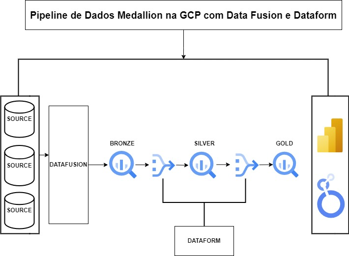

# Pipeline de Dados Medallion na GCP com Data Fusion e Dataform

## Visão Geral

Este projeto implementa um pipeline de dados seguindo a arquitetura Medallion na Google Cloud Platform (GCP). A arquitetura Medallion organiza os dados em camadas distintas, cada uma com um nível crescente de qualidade e processamento. Neste projeto, utilizamos o Data Fusion para a ingestão inicial dos dados e o Dataform para gerenciar e versionar as transformações subsequentes nas camadas Bronze, Silver e Gold. Observamos que a criação dessas camadas utilizando SQL gerava menos custo, tornando o processo mais eficiente financeiramente.

## Arquitetura do Pipeline




### Componentes Principais

- **Google Cloud Storage (Fonte de Dados):** Os dados brutos são armazenados no Google Cloud Storage. Eles podem incluir arquivos em diferentes formatos, como CSV, JSON, Parquet, entre outros.

- **Data Fusion:** Responsável pela ingestão dos dados brutos a partir do Google Cloud Storage e pela criação da camada Bronze.

- **Dataform:**
  - **Camada Bronze:** Os dados ingeridos pelo Data Fusion são processados na camada Bronze.
  - **Camada Silver:** O Dataform cria uma source a partir dos dados da camada Bronze, aplica transformações adicionais usando SQL e grava os dados processados na camada Silver.
  - **Camada Gold:** O Dataform cria uma nova source a partir dos dados da camada Silver. Esses dados são então processados e gravados na camada Gold, prontos para consumo em relatórios e análises. A decisão de usar SQL para essas transformações foi baseada na observação de que gerava menos custos operacionais.

- **BigQuery:** O BigQuery é utilizado como o data warehouse para armazenar as camadas Bronze, Silver e Gold.

- **Ferramentas de BI:** Os dados processados na camada Gold são carregados em ferramentas de Business Intelligence para visualização e análise.

## Como Executar o Projeto

1. **Clonar o Repositório:** Clone este repositório para sua máquina local.
   ```bash
   git clone https://github.com/seu-usuario/seu-repositorio.git
